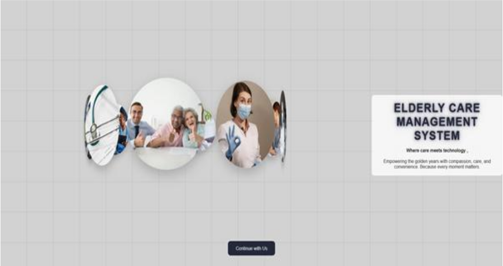
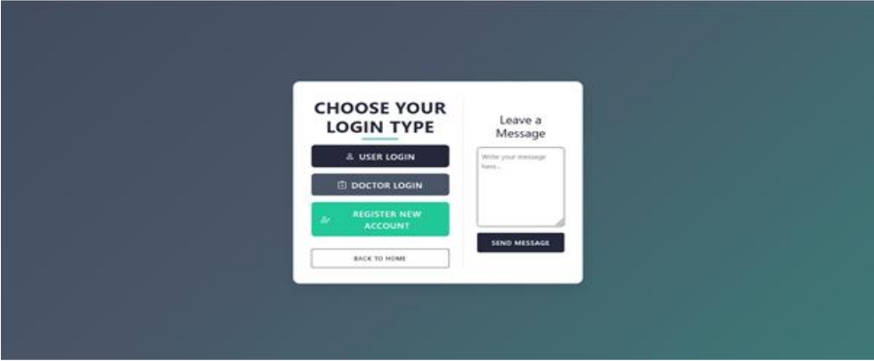
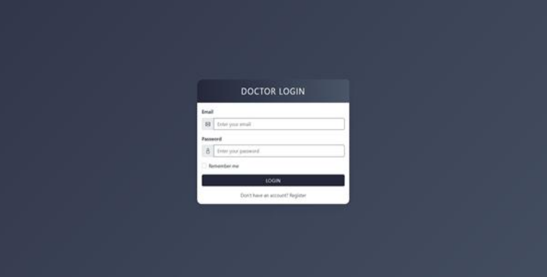
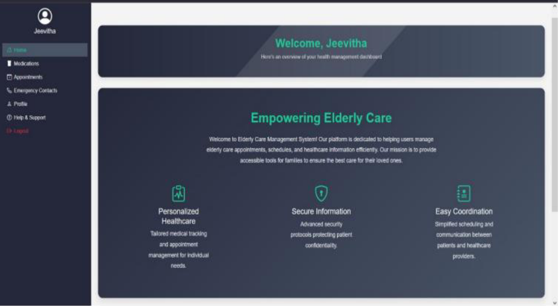
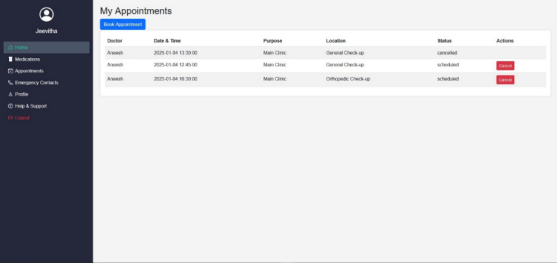
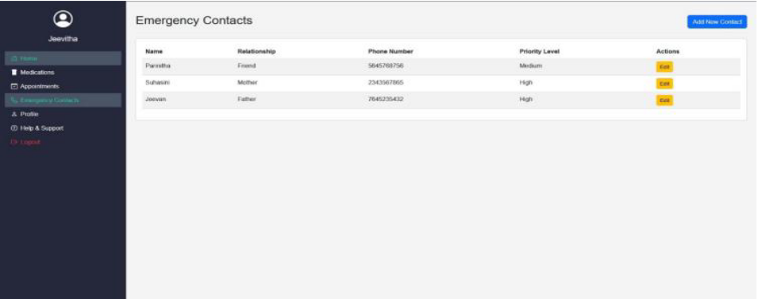
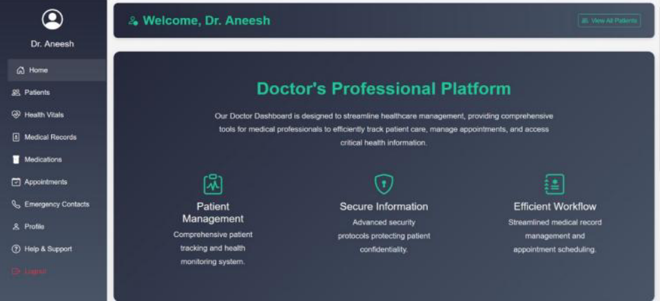
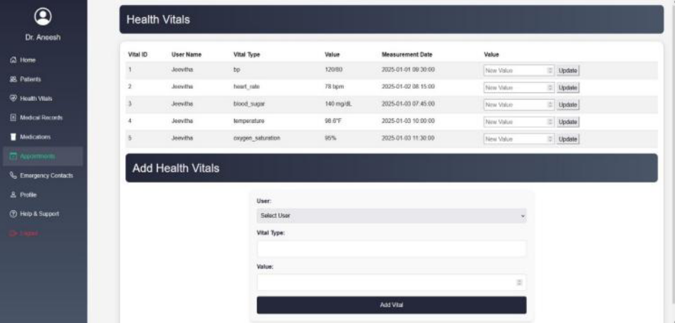
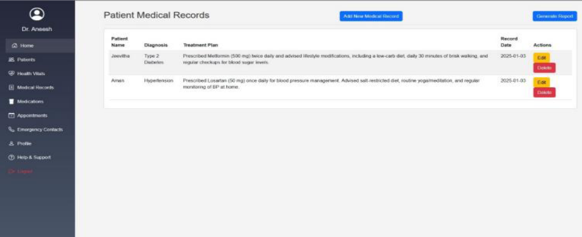

# 🏥 Elderly HealthCare Management System

### 📅 Year: 2024  
**Technologies Used:** HTML5, CSS3, JavaScript, PHP, MySQL  
**Developed By:**  
- **Shravya A (4SF22CS201)**  
- **Avani (4SF22CS039)**  
**Under the Guidance of:**  
*Ms. Ashwini C S, Assistant Professor, Dept. of CS&E*  
*Sahyadri College of Engineering & Management, Mangaluru*

---

## 📖 Project Overview

The **Elderly HealthCare Management System (EHMS)** is a web-based platform developed to streamline healthcare services for elderly patients. It provides an efficient and secure way to manage **appointments, medical records, medications, health vitals, and emergency contacts**.  
The system integrates both **Patient and Doctor Dashboards**, enabling smooth communication and management between patients, doctors, and caregivers.

---

## 🎯 Objective

To design a **Database-Driven Healthcare System** using MySQL and PHP that provides:
- Centralized access to medical records  
- Automated notification triggers for health events and appointments  
- A user-friendly web interface for elderly patients and families  
- Role-based login (Doctor / Patient)  
- Secure and efficient data management  

---

## 🧩 Key Features

### 👨‍⚕️ Patient Dashboard
- View and manage **appointments, medications, and medical records**
- Maintain **emergency contacts**
- Update **profile details**
- Access **help & support**

### 🩺 Doctor Dashboard
- Manage **patient health vitals**
- Add or update **medical records and prescriptions**
- View and schedule **appointments**
- Generate **patient reports**
- Access **help & support**

---

## 🗄️ Database Design

The backend uses **MySQL** as the database, following **Third Normal Form (3NF)** to ensure data consistency and integrity.  

### Main Tables:
- `users`
- `doctor_details`
- `patient_details`
- `appointments`
- `medical_records`
- `medications`
- `health_vitals`
- `emergency_contacts`

Relationships between tables were implemented using **primary and foreign keys**, ensuring referential integrity across entities.

---

## ⚙️ Implementation Details

### 🔸 Backend
Developed using **PHP 8.2** on **XAMPP 8.1x**, connected to **MySQL 8.0** via `mysqli`.

- Implemented **notification triggers** to alert users of new appointments or health updates.
- Used **prepared statements** to enhance database security and prevent SQL injection.
- Included **error handling** to ensure stable runtime behavior.

### 🔸 Frontend
Built using **HTML5**, **CSS3**, and **JavaScript**:
- Responsive design using CSS Grid & Flexbox
- Dynamic navigation and alert modals via JavaScript
- Sliding image gallery on homepage for engagement
- Accessibility-focused design for elderly usability

---

## 📸 Sample Screenshots

- **Home Page** – Sliding gallery and mission statement  
- **Login Page** – Role-based login (Doctor / Patient)  
- **User Dashboard** – Appointments, Medications, and Emergency Contacts  
- **Doctor Dashboard** – Patient Management, Medical Records, Health Vitals  
- **Help & Support** – FAQ and contact support section  

### 🏠 Home Page  


### 🔑 Login & Register  



### 👩‍⚕️ Patient Dashboard  




### 👨‍⚕️ Doctor Dashboard  





---

## 🧠 Learning Outcome

Through this project, we gained practical experience in:
- **Database normalization and schema design**
- **Front-end and back-end integration using PHP and SQL**
- **Trigger-based notification systems**
- **User experience (UX) design for accessibility**
- **Secure and structured data handling**

---

## 🧾 Conclusion

The Elderly HealthCare Management System successfully provides a **comprehensive, secure, and accessible platform** for managing elderly healthcare data. It improves efficiency, promotes better communication between patients and doctors, and demonstrates the real-world application of **DBMS, PHP, and web development** technologies.

---

## 🧰 Tools & Technologies

| Category | Tools / Technologies |
|-----------|----------------------|
| Frontend | HTML5, CSS3, JavaScript |
| Backend | PHP 8.2 |
| Database | MySQL 8.0 |
| Server | Apache 2.4 (via XAMPP 8.1x) |
| IDE | VS Code / Sublime Text |
| OS | Windows 10 |

---

## 🚀 Setup Instructions

1. Clone the repository:
   ```bash
   git clone https://github.com/shravya-a/Elderly-HealthCare-Management-System.git
2. Move project files to your XAMPP/htdocs folder.

3. Start Apache and MySQL from XAMPP Control Panel.

4. Import the SQL schema:

5. Open phpMyAdmin

6. Create a new database named elderly_care_management

7. Import elderly_care_management.sql

8. Run the project: http://localhost/Elderly-HealthCare-Management-System/
